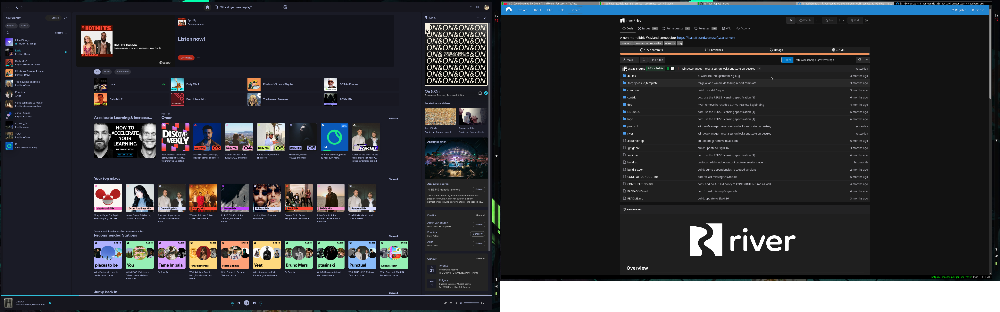

# NixOS Configuration



NixOS + Home Manager flake using River (Wayland compositor), and rill (scrolling window manager).

## Structure

```
flake.nix                  # Entry point — change `username` here
hosts/                     # System-level NixOS config
  default.nix              # Host entry point, driver toggles, user setup
  hardware-configuration.nix  # Generated — replace with yours
  boot.nix                 # Kernel, bootloader, sysctl
  networking.nix           # NetworkManager, firewall, locale
  nix.nix                  # Nix settings, GC
  security.nix             # Polkit, PAM, rtkit
  services.nix             # TLP, Tailscale, avahi, zram, etc.
  virtualization.nix       # Podman, libvirtd
  hardware/                # GPU drivers, bluetooth, legion module
  desktop/                 # River, greetd, audio (PipeWire)
  packages/                # System packages, dev tools, OrcaSlicer
  overlays/                # River 0.4.5 + rill 0.6.0 overlay
    rill/                  # Rill WM source (used by overlay)
home/                      # User-level Home Manager config
  default.nix              # Spicetify, Widevine, mimeapps
  programs/git.nix         # Git config
  programs/zsh.nix         # Zsh, aliases, oh-my-zsh
dotfiles/                  # Raw dotfiles copied to ~/.config/
```

## Using this config

### 1. Clone

```bash
git clone <this-repo> ~/Documents/nixos
cd ~/Documents/nixos
```

### 2. Set your username

Edit `flake.nix` — change the `username` variable (line 40):

```nix
username = "your-username";
```

This propagates everywhere: hostname, home-manager, user account, nix trusted-users, greetd, etc.

### 3. Set your git email

Edit `home/programs/git.nix` — change the `email` field.

### 4. Generate hardware config

```bash
sudo nixos-generate-config --show-hardware-config > hosts/hardware-configuration.nix
```

### 5. Adjust drivers

In `hosts/default.nix`, toggle the driver flags for your hardware:

```nix
drivers = {
  amdgpu.enable = false;    # AMD GPU
  intel.enable = true;       # Intel iGPU
  nvidia.enable = true;      # NVIDIA dGPU
  nvidia-prime = {
    enable = true;           # Hybrid graphics
    intelBusID = "PCI:0:2:0";
    nvidiaBusID = "PCI:1:0:0";
  };
  legion.enable = true;      # Lenovo Legion-specific (remove if not Legion)
};
```

Find your bus IDs with `lspci | grep -E 'VGA|3D'`.

### 6. Build

```bash
./rebuild.sh
```

### 7. Dotfile changes

Press `Super+Shift+R` to reload dotfiles without a full rebuild.

## Hybrid graphics

System runs on iGPU by default. Offload to dGPU:

```bash
nvidia-offload steam
nvidia-offload blender
```
